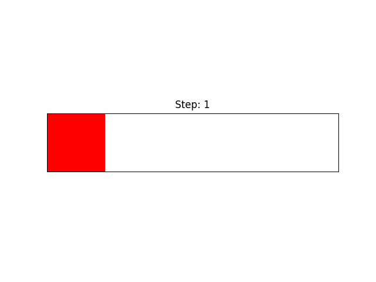
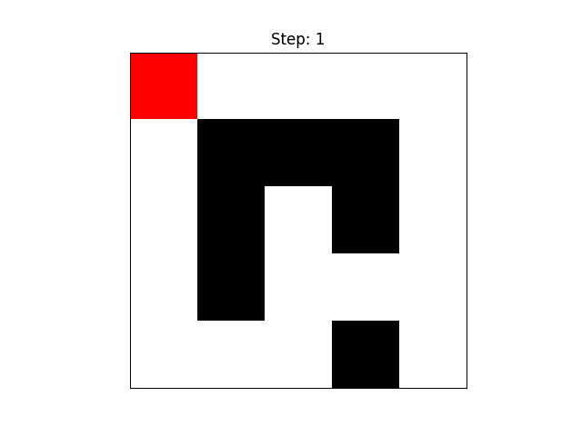
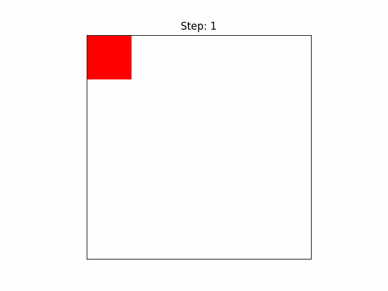
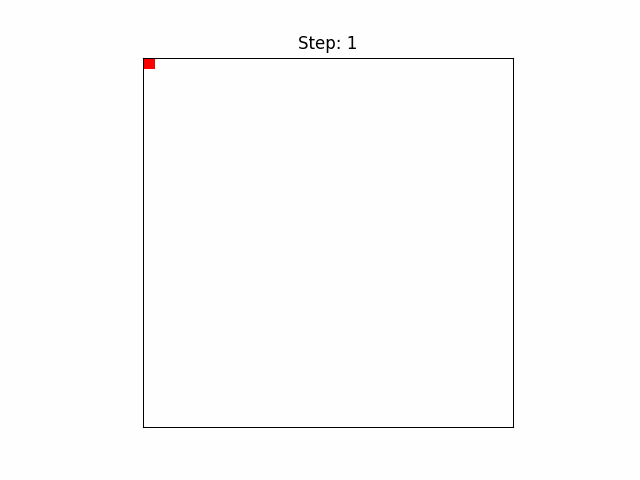

# <div style="text-align: center;"> Laboratory 1  </div >
# <div style="text-align: center;"> Variant 2  </div >
# <div style="text-align: center;"> By Sevastian Bortsevich, Yermukhamed Islam  </div >
## Introduction ##
The task is to solve a maze using the Greedy Best-First Search algorithm and visualize the process. This algorithm is commonly used for pathfinding and graph traversal. It makes decisions based on a heuristic function that estimates the distance from the current position to the goal. 

The main advantage of this algorithm is its speed, as it quickly chooses the most promising path. However, its downside is that it does not always find the shortest path because it does not consider the total cost of the path taken so far.

## Implementation ##

The solution has two main parts: the `greedy` function, which runs the search algorithm, and the `visualize_animation` function, which shows the search process step by step.

### Search Algorithm (`greedy` function)

The function takes a maze (a 2D grid), a start position, a finish position, and a heuristic type (either "euclidean" or "manhattan"). It follows these steps:

1. **Define the heuristic function:**
   ```python
   def heuristic(position, finish):
       if heuristic_type == "manhattan":
           return abs(position[0] - finish[0]) + abs(position[1] - finish[1])
       elif heuristic_type == "euclidean":
           return pow(position[0] - finish[0], 2) + pow(position[1] - finish[1], 2)
   ```
   - The Manhattan heuristic is good for grid-based movement where diagonal moves are not allowed.
   - The Euclidean heuristic calculates the squared distance to avoid the costly square root operation.

2. **Initialize the search:**
   ```python
   frontier = []
   frontier.append((init_val, start))
   explored = {}
   ```
   - The frontier is a priority queue that holds nodes sorted by heuristic values.
   - The explored dictionary keeps track of visited nodes.

3. **Process the nodes in the frontier:**
   ```python
   while frontier:
       frontier = sorted(frontier, key=lambda x: x[0])
       current = frontier.pop(0)[1]
       explored[current] = True
   ```
   - The node with the smallest heuristic value is chosen.
   - If the goal is reached, the function returns the number of explored nodes.
   - Otherwise, the algorithm expands the neighbors of the current node.

4. **Explore valid neighbors:**
   ```python
   for i in range(0, 4):
            if not current[0] + x_mod[i] >= 0:
                continue 
            if not current[0] + x_mod[i] < len(maze):
                continue
            if not current[1] + y_mod[i] >= 0:
                continue
            if not current[1] + y_mod[i] < len(maze[0]):
                continue
            if not maze[current[0] + x_mod[i]][current[1] + y_mod[i]] == 0:
                continue
            if not (current[0] + x_mod[i], current[1] + y_mod[i]) not in explored:
                continue
            if not (current[0] + x_mod[i], current[1] + y_mod[i]) not in frontier:
                continue
            frontier.append((heuristic((current[0] + x_mod[i], current[1] + y_mod[i]), finish), 
                             (current[0] + x_mod[i], current[1] + y_mod[i])))
   ```
   - The function checks if a neighboring cell is within bounds and is not a wall.
   - If the neighbor has not been visited, it is added to the frontier with its heuristic value.

If there is no path to the goal, the function returns (-1, -1).

### Visualization (`visualize_animation` function)

This function creates an animation to show how the algorithm searches for a path:

1. **Prepare the visualization environment:**
   ```python
   fig, ax = plt.subplots()
   viz_list = list(viz.keys())
   path_set = set()
   frames = []
   ```
   - A figure is created for displaying the maze.
   - A set is used to keep track of visited nodes.

2. **Define the update function:**
   ```python
   def update(step):
       temp_maze = np.array(maze)
       display_maze = np.ones_like(temp_maze, dtype=np.float32)
       display_maze[temp_maze == 1] = 0.0
       img = np.dstack([display_maze, display_maze, display_maze])
   ```
   - The maze is converted into an image where walls are black, and open paths are white.
   - Cells visited by the algorithm are marked red.

3. **Animate the search process:**
   ```python
   ani = animation.FuncAnimation(fig, update, frames=len(viz_list), interval=500, repeat=True)
   plt.show()
   ```
   - Updates the maze at each step and displays it using Matplotlib’s animation functions.

4. **Save animation as GIF (optional):**
   ```python
   if save_as_gif and frames:
       frames[0].save(gif_name, save_all=True, append_images=frames[1:], duration=500, loop=0)
   ```
   - If enabled, the animation is saved as a GIF file.

## Discussion ##

The Greedy Best-First Search algorithm works well in simple mazes where the heuristic can accurately estimate the best path. However, in more complex mazes with obstacles and misleading paths, it may take a longer or inefficient route. Here are some test cases:

1. **Straight-line path:**
   - The algorithm quickly reaches the goal because the heuristic is accurate.

<div style="text-align: center;">
</div>
<p style="text-align:center;">
Figure 1: Straight line with Euclidean</p>

2. **Maze with multiple paths / Maze with obstacles:**
   - The algorithm might take a longer route if a seemingly good path leads to a dead-end.
   - Since the algorithm does not consider the total path cost, it may choose a suboptimal route.

<div style="text-align: center;">
</div>
<p style="text-align:center;">
Figure 2: Rational Bézier curve – polynomial curve defined in homogeneous coordinates (blue) and its projection on plane – rational curve (red)</p>

4. **Empty maze with different heuristics**
   - Running the tests with Manhatten and Eucledean heuristics on an empty maze clearly shows the difference in their pathfinding.

<div style="text-align: center;">
</div>
<p style="text-align:center;">
Figure 3: Empty maze pathfinding with Euclidean</p>

<div style="text-align: center;">
</div>
<p style="text-align:center;">
Figure 4: Empty maze pathfinding with Manhatten</p>

5. **ETC**  There are 24 tests in total that you can view in the ``lab1_tests.py`` file

<div style="text-align: center;">
</div>
<p style="text-align:center;">
Figure 5: A big empty maze with eucledean for funzies</p>

## Conclusion ##
- The algorithm is fast but does not always find the shortest path.
- The choice of heuristic affects performance.

## Remark ##
To view all the pretty animations of the pathfinding either open the preview of the markdown file of the report or open the Gifs directly.


